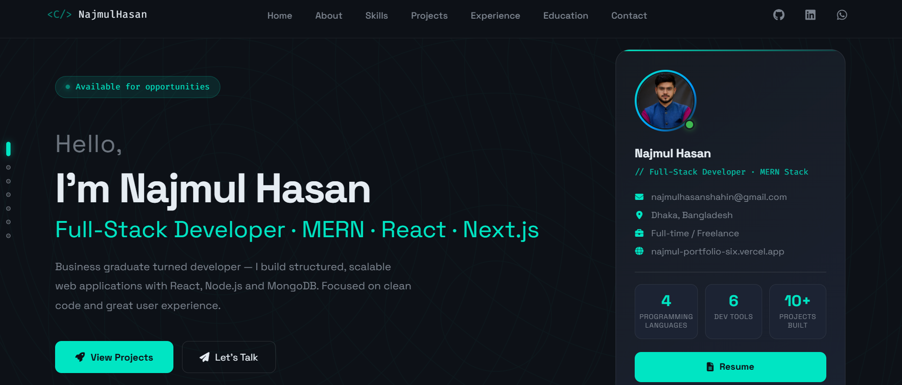
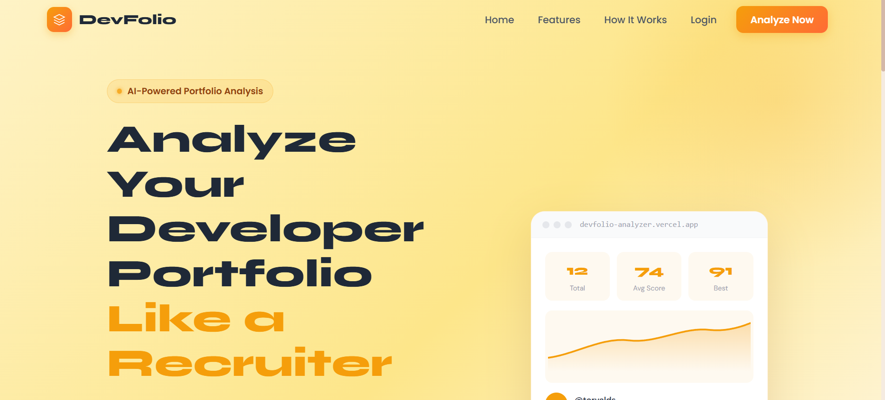
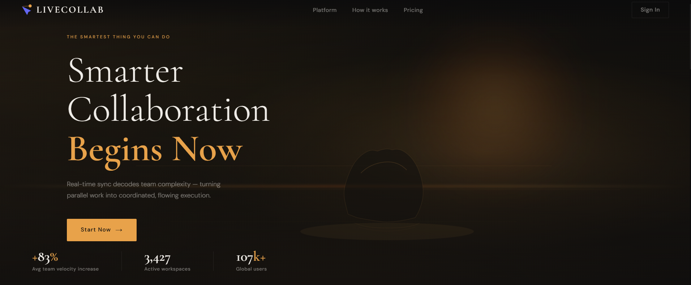
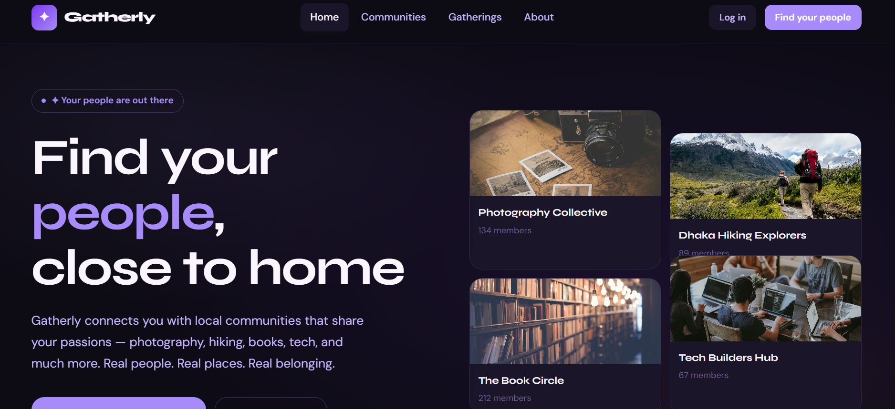

<!-- PREMIUM HEADER -->

<p align="center">

</p>

<p align="center">
<b>Full Stack Engineer &nbsp;·&nbsp; Founder &nbsp;·&nbsp; CEO & CPO — Navicore Software</b><br/>
A developer portfolio showcasing production projects, technical depth, and the ventures I run.
</p>

<p align="center">


</p>

---

# 🌐 Live Portfolio

**👉 [najmulcodes.vercel.app](https://najmulcodes.vercel.app/)**

<p align="center">
  <a href="https://najmulcodes.vercel.app/" target="_blank">
    
  </a>
</p>

---

# 🧑‍💻 About This Project

This portfolio was built to present my work as a **Full Stack Engineer and Founder**, highlighting production-grade projects, live ventures, technical capabilities, and professional background.

The goal is to give clients, collaborators, and employers a **clear, honest picture of what I build and how I work.**

The site covers:

- Clean developer-focused UI with smooth animations
- Responsive layout across all devices
- Production project showcase with live links
- Live venture section (Navicore Software + RailMate Bangladesh)
- Professional experience and education timeline
- Direct contact for work opportunities

---

# 🏢 Live Ventures

| Venture | Role | Status |
|---------|------|--------|
| [Navicore Software](https://software.navicore.co) | Founder, CEO & CPO | Active |
| [RailMate Bangladesh](https://railmatebd.com) | Founder, Lead Engineer | Live Beta |

---

# 🚀 Tech Stack

| Layer | Technology |
|-------|-----------|
| Frontend Framework | Next.js (App Router) |
| UI Library | React 19 |
| Styling | Custom CSS |
| Animations | Framer Motion |
| Icons / Fonts | Font Awesome + Google Fonts |
| Contact Form | Formspree |
| Deployment | Vercel |

---

# ✨ Key Features

### Production-Grade Portfolio
Built to reflect real engineering standards — not a template, not a tutorial.

### Fully Responsive
Optimized for Mobile, Tablet, and Desktop.

### Smooth Navigation
Fixed top navigation · Section-based scrolling · Active section indicators

### Animated Interface
Reveal-on-scroll effects · Interactive cards · Smooth hover states

### Professional Sections
Hero · About · Skills · Projects · Experience · Education · Contact

---

# 📂 Project Structure
```
app/
├── layout.js
├── page.js
├── globals.css
└── projects/
    └── [slug]/
        └── page.js

components/
├── Navbar.jsx
├── Footer.jsx
├── ContactForm.jsx
└── WordRotate.jsx

public/
├── profile.jpg
└── projects/
    ├── portfolio.png
    ├── badaruddin.png
    ├── bookhub.png
    ├── carexyz.png
    ├── clubsphere.png
    ├── microtask.png
    ├── devfolio-analyzer.png
    ├── livecollab.png
    └── gatherly.png
```

---

# 📌 Featured Projects

> Click any thumbnail to visit the live site.

---

## 🏆 Badar Uddin Welfare – Charity Management Platform

<a href="https://badaruddinwelfareorg.vercel.app/" target="_blank">
  
</a>

**Tagline:** Production welfare management for a live Bangladeshi NGO

A production system actively used by a real organisation. Replaces manual fund-tracking with role-based access (Admin / Member), donation request lifecycle with approval gates, beneficiary records, and Cloudinary-backed media. Built to operational standards.

**Features:**
- Public website for donation requests
- Private member portal
- Fund and donation tracking dashboards
- Help request approval workflow

**Tech Stack:**


**Links:**
🌐 [Live Site](https://badaruddinwelfareorg.vercel.app/) &nbsp;|&nbsp; 💻 [Source Code](https://github.com/najmulcodes/badaruddinwelfare-client)

---

## ⚡ MicroTask Platform – Freelance Micro-Tasking Marketplace

<a href="https://microtask-client-iota.vercel.app" target="_blank">
  
</a>

**Tagline:** Three-sided role-based marketplace with Stripe payments

A multi-role micro-tasking platform with Worker, Buyer, and Admin dashboards. Role is enforced server-side — not inferred from client state. Stripe coin-based payment system, full task lifecycle, and Google OAuth.

**Features:**
- Role-based dashboards (Worker / Buyer / Admin)
- Task posting and submission flow
- Stripe payment integration
- Google OAuth authentication

**Tech Stack:**


**Links:**
🌐 [Live Site](https://microtask-client-iota.vercel.app) &nbsp;|&nbsp; 💻 [Source Code](https://github.com/najmulcodes/microtask-client)

> **Demo Credentials:** Email: `admin@microtask.com` · Password: `Admin123` · Role: Admin

---

## 🤖 DevFolio Analyzer – AI-Powered GitHub Profile Analyzer

<a href="https://devfolio-analyzer.vercel.app/" target="_blank">
  
</a>

**Tagline:** AI-Powered GitHub Profile Analyzer

Fetches live GitHub data, scores profiles deterministically across 6 weighted factors, then layers Claude API insights on top. AI fails gracefully — output stays consistent regardless. Authenticated users get persistent history with score-over-time charting.

**Features:**
- GitHub Profile Analysis via REST API
- Deterministic scoring (0–100) across 6 key factors
- AI-Powered insights using Anthropic Claude API
- Guest Mode — instant analysis, no account required
- Authenticated users can save history and track scores
- KPI cards, score-over-time chart (Recharts), and activity table

**Tech Stack:**


**Links:**
🌐 [Live Site](https://devfolio-analyzer.vercel.app/) &nbsp;|&nbsp; 💻 [Source Code](https://github.com/najmulcodes/devfolio-analyzer)

---

## 🎯 LiveCollab – Real-Time Team Collaboration Platform

<a href="https://livecollab-rho.vercel.app/" target="_blank">
  
</a>

**Tagline:** Real-Time Kanban with Socket.IO sync

Real-time Kanban board with drag-and-drop sync across all connected clients. Rooms scoped per workspace, optimistic updates with server-side conflict resolution, heartbeat-based presence tracking, invite-code onboarding, and a persistent activity log.

**Features:**
- JWT-based register / login with protected routes
- Workspaces with invite codes and member management
- Real-Time Kanban Board — drag-and-drop via Socket.IO
- Live Presence — see who's online in your workspace
- Timestamped Activity Log for every board action
- Zustand + React Query for efficient client-side state

**Tech Stack:**


**Links:**
🌐 [Live Site](https://livecollab-rho.vercel.app/) &nbsp;|&nbsp; 💻 [Source Code](https://github.com/najmulcodes/livecollab-client)

---

## 🌍 Gatherly – Community Discovery Platform

<a href="https://gatherly-navy.vercel.app/" target="_blank">
  
</a>

**Tagline:** Community Discovery Platform — Next.js 14 + TypeScript

Community discovery platform with dual-provider auth via NextAuth.js (credentials + Google OAuth), edge-level route protection via Next.js middleware, and a searchable community catalog. Mobile-first, built around real browsing patterns.

**Features:**
- Email/password credentials + Google OAuth via NextAuth.js
- Searchable, filterable community catalog with category chips
- Protected 'Start a Community' form with inline validation
- Protected 'Manage Communities' table with View and Remove actions
- Fully responsive mobile-first layout with hamburger nav

**Tech Stack:**


**Links:**
🌐 [Live Site](https://gatherly-navy.vercel.app/) &nbsp;|&nbsp; 💻 [Source Code](https://github.com/najmulcodes/Gatherly)

---

## 🩺 Care.xyz – Caregiver Booking Platform

<a href="https://care-xyz-baby-sitting-elderly-care.vercel.app" target="_blank">
  
</a>

**Tagline:** Care Service Booking — Next.js · Firebase Auth

Next.js caregiver booking platform with cascading location selectors (district → sub-district), a dynamic pricing engine by service type and duration, and Firebase auth with protected routes enforced at both page and API level.

**Features:**
- Cascading location selectors
- Dynamic cost calculation
- Private booking routes
- Firebase authentication

**Tech Stack:**


**Links:**
🌐 [Live Site](https://care-xyz-baby-sitting-elderly-care.vercel.app) &nbsp;|&nbsp; 💻 [Source Code](https://github.com/najmulcodes/Care.xyz---Baby-Sitting-Elderly-Care-Service-Platform)

---

## 🎯 ClubSphere – Membership & Event Management System

<a href="https://clubsphere-client1.netlify.app/" target="_blank">
  
</a>

**Tagline:** Membership & Event Management System

Role-based club management system with event handling, membership approval flows, and protected routes using JWT authentication.

**Features:**
- JWT-protected routes
- Membership approval flow
- Event and member management
- Responsive dashboard interface

**Tech Stack:**


**Links:**
🌐 [Live Site](https://clubsphere-client1.netlify.app/) &nbsp;|&nbsp; 💻 [Source Code](https://github.com/najmulcodes/clubsphere-client)

---

## 📚 BookHub – Online Book Platform

<a href="https://bookhub-heaven.surge.sh" target="_blank">
  
</a>

**Tagline:** Book Management Platform

CRUD-based application for managing books with REST API integration. Includes real-time UI updates and structured data handling.

**Features:**
- Browse and manage books
- Add, edit, and delete functionality
- Real-time state updates
- Clean responsive interface

**Tech Stack:**


**Links:**
🌐 [Live Site](https://bookhub-heaven.surge.sh) &nbsp;|&nbsp; 💻 [Source Code](https://github.com/najmulcodes/bookhub-client)

---

# 🧠 Background

I hold a **Bachelor of Business Administration in Accounting & Finance** and transitioned into full-stack engineering to build production-grade software systems.

I now run **Navicore Software** — a software development company building custom solutions for clients in Bangladesh and internationally — and **RailMate Bangladesh**, a live railway companion app for millions of potential passengers.

My business and analytical background shapes how I approach software: scoped precisely, built to last, and maintained like it still has to work in five years.

---

# 📬 Contact

| Platform | Link |
|----------|------|
| 📧 Email | [najmulhasanshahin@gmail.com](mailto:najmulhasanshahin@gmail.com) |
| 🌐 Navicore Software | [software.navicore.co](https://software.navicore.co) |
| 🐙 GitHub | [github.com/najmulcodes](https://github.com/najmulcodes) |
| 💼 LinkedIn | [linkedin.com/in/najmulcodes](https://www.linkedin.com/in/najmulcodes/) |
| 💬 WhatsApp | [wa.me/8801840242448](https://wa.me/8801840242448) |

---

# ⚙ Installation & Setup

```bash
git clone https://github.com/najmulcodes/najmul-portfolio.git
cd najmul-portfolio
npm install
npm run dev
```

Production build:

```bash
npm run build
npm run lint
```

---

# 🚀 Deployment

Deployed on **Vercel** — [najmulcodes.vercel.app](https://najmulcodes.vercel.app/)

---

# 📄 License

MIT License — open source, feel free to reference.

---

<p align="center">
⭐ If you find this useful, a star on GitHub is appreciated.
</p>

<p align="center">

</p>
